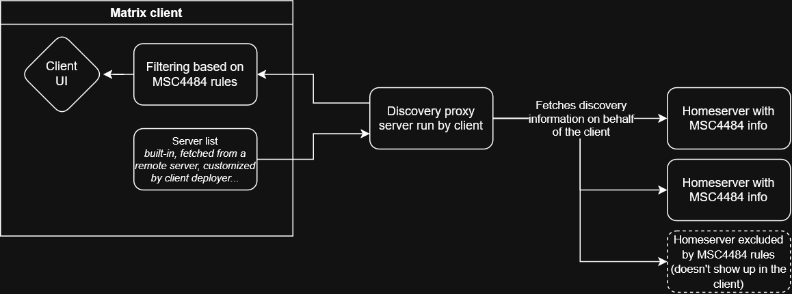

# Architecture

## General Concepts

### Static lists

All concepts here assume a static list mainained by hand or eg. Pull Requests or Github Issue templates.

- Hardcoded Lists
- Hardcoded Web Picker on matrix.org
- Hardcoded JSON file
  - Fetched by Web Picker
  - Fetched by clients
- List file/JSON/API that loads from a server (set by the client developer)
  - Great for "Enterprise Clients" (eg. a state for all healthcare-providers)

### Dynamic lists

- Hardcoded list on matrix.org to asks servers if they accept registrations
- Hardcoded list on any server to asks servers if they accept registrations (set by the client developer)
  - Client asks all servers if they have open reg
- Config file => (semi-)dynamically generated List => Client only needs to fetch one file
  - Data might be a bit delayed
- Config file & Discovery Proxy
  - Data is up to date, only list provider knows client
  - Might be significant load
  
